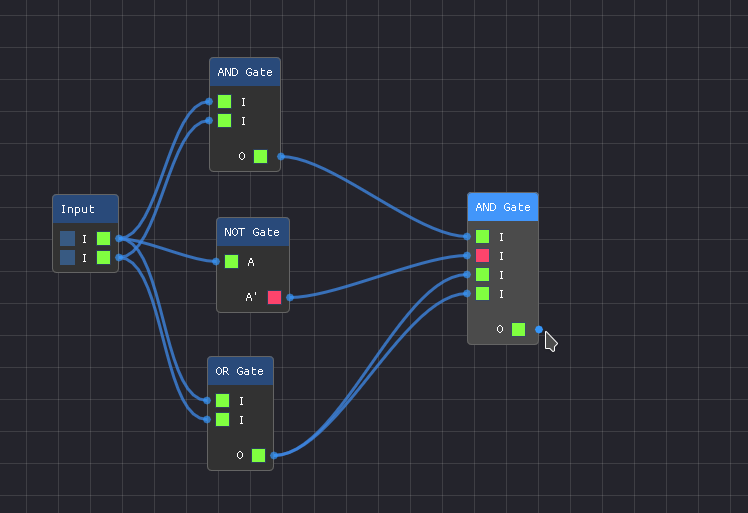

# Mantik   [](https://github.com/deosulav/Mantik)  [](https://github.com/deosulav/Mantik/blob/main/res/OOP_Project_Report.pdf)    [](https://github.com/libsdl-org/SDL)  [](https://github.com/Nelarius/imnodes) [](https://github.com/ocornut/imgui) [](LICENSE.md)

**Mantik**  is a digital logic simulation program designed for extensibility, i.e. by making a few minor changes, new circuit elements can be added to the program. It is specifically designed for simulation of combinational logic. 

**This Project is for the completion of the course of Object Oriented Programming (OOP) [CT 501] Lab in Year II Part I.**

By
[Srijan Poudel](https://github.com/srijanpdl "076BCT081"),
[Sulav Deo](https://github.com/deosulav "076BCT086") and
[Sumit Yadav](https://github.com/rockerritesh "076BCT088")


# Setup
## Windows:

1. Ensure dll files ([glew32.dll](deps/GL/libs/glew32.dll) and [SDL2.dll](/deps/SDL2/libs/SDL2.dll)) are present in working directory.

## Linux:

1. Ensure shared libs glu, glew and sdl2 are present
   ```bash
   pacman -S sdl2-compat glu glew
   ```

# Compiling and Executing:

1. First clone this repository:
   
   ```bash
   git clone https://github.com/srijanpdl/ProteusCloneSDL.git
   ```

2. Change the directory to `Mantik`:
   
   ```bash
   cd Mantik/
   ```

3. Run make (for Linux) or use `Mantik.sln` (for Windows):
   
   ```bash
   make
   ./bin/Mantik # executing the executable binary file
   ```

# Screenshot
> Sample Shot
 <br>

> All Components (and more)
 <br>

> DEMUX 8x1

