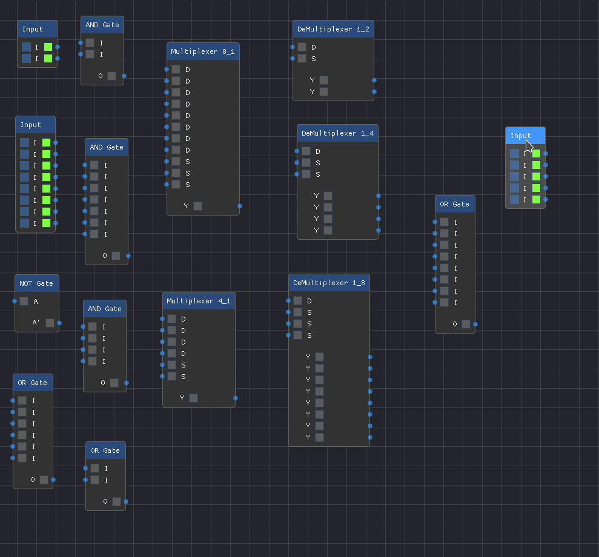
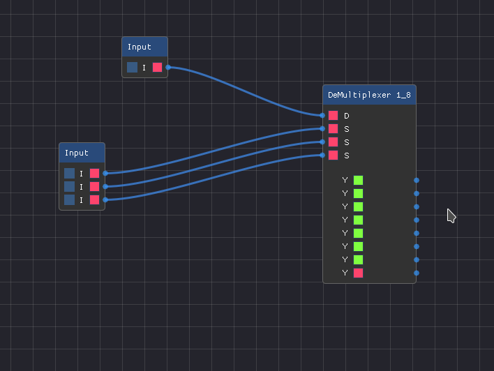

# ProteusCloneSDL   [](https://github.com/srijanpdl/ProteusCloneSDL)  [](https://github.com/srijanpdl/ProteusCloneSDL/blob/main/OOP_Project_Report.pdf)    [](https://github.com/libsdl-org/SDL)  [](https://github.com/Nelarius/imnodes) [](https://github.com/ocornut/imgui) [](LICENSE.md)

### **ProteusCloneSDL**  is a digital logic simulation program designed for extensibility, i.e. by making a few minor changes one can add new circuit elements to the program. One can visualize and simulate any combinational circuit. Even if some circuit components are missing, one can easily add them. I would like to mention this program is specifically designed for simulation of combinational logic. 
<br>
</br>


# Screenshot
> Sample Shot
 <br>

> All Components (and more)
 <br>

> DEMUX 8x1


<br>
</br>

# Compiling and Executing:
## GNU/Linux:
1. First clone this repository:
   
   ```bash
   git clone https://github.com/srijanpdl/ProteusCloneSDL.git
   ```

2. Change the directory to `ProteusCloneSDL`:
   
   ```bash
   cd ProteusCloneSDL/
   ```

3. Then execute the accompanying bash script `build` after making it executable:
   
   ```bash
   make   # making the script executable
   ./bin/ProteusClone           # executing the executable binary file
   ```

<br>
</br>  

# BY

* [Srijan Poudel](https://github.com/srijanpdl "076BCT081")
* [Sulav Deo](https://github.com/OkabeKiyouma "076BCT086")
* [Sumit Yadav](https://github.com/rockerritesh "076BCT088")


**This Project is for the completion of the course of Object Oriented Programming (OOP) [CT 501] Lab.**

Year: II <br>
Part: I	

# 
